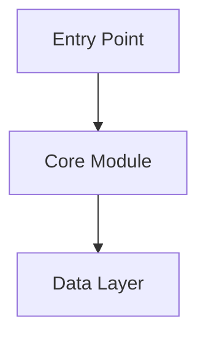

# Architecture

> Maintained by DocuTrack. Updated automatically as the codebase evolves.

---

## Overview

<!-- Describe the system's purpose in 2-3 sentences -->

## Tech Stack

| Layer | Technology | Notes |
|-------|------------|-------|
| | | |

## Module Map

<!-- List of main modules with their single responsibility -->

| Module | Path | Responsibility |
|--------|------|---------------|
| | | |

## System Diagram

## Key Decisions

See [`docs/decisions/`](docs/decisions/) for Architecture Decision Records.

## Integrations

<!-- External services, databases, queues, third-party APIs -->

| Service | Purpose | Connection |
|---------|---------|------------|
| | | |

## Environment Variables

<!-- Key env vars and what they control -->

| Variable | Required | Description |
|----------|----------|-------------|
| | | |
