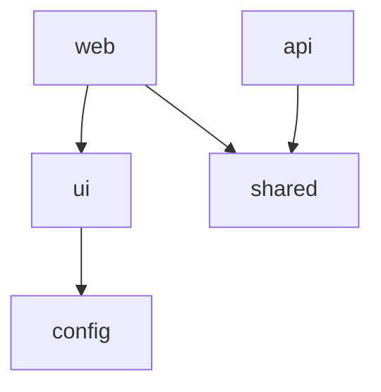

# Architecture

> Maintained by DocuTrack. Updated automatically as the codebase evolves.

---

## Overview

<!-- Describe the monorepo's purpose and what apps/packages live here -->

## Tech Stack

| Layer | Technology | Notes |
|-------|------------|-------|
| Monorepo tooling | | Turborepo / Nx / pnpm workspaces |
| Package manager | | pnpm / npm / yarn |
| Build | | |
| Shared types | | |

## Package Map

| Package | Path | Type | Responsibility |
|---------|------|------|---------------|
| | `apps/web` | App | |
| | `apps/api` | App | |
| | `packages/ui` | Library | |
| | `packages/shared` | Library | |
| | `packages/config` | Config | |

## Dependency Graph

## Cross-Package Contracts

| Contract | Defined in | Consumed by |
|---------|-----------|------------|
| API types | `packages/shared` | `apps/web`, `apps/api` |

## Integration Points

| Apps | Communicate via | Notes |
|------|----------------|-------|
| `web` ↔ `api` | REST / tRPC / GraphQL | |

## Key Decisions

See [`docs/decisions/`](docs/decisions/) for Architecture Decision Records.

## Environment Variables

| Variable | Package | Required | Description |
|----------|---------|----------|-------------|
| | | | |
