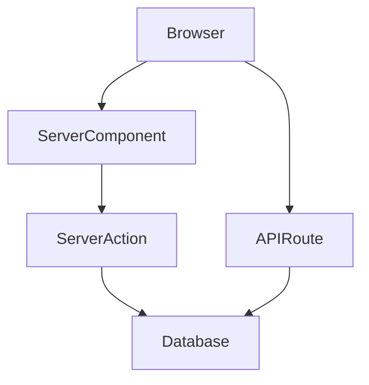

# Architecture

> Maintained by DocuTrack. Updated automatically as the codebase evolves.

---

## Overview

<!-- Describe the app's purpose in 2-3 sentences -->

## Tech Stack

| Layer | Technology | Notes |
|-------|------------|-------|
| Framework | Next.js (App Router) | |
| Styling | | |
| Auth | | |
| Database | | |
| ORM | | |
| State | | |
| Deployment | | |

## App Structure

```
app/
├── (auth)/          ← route group: auth pages
├── (dashboard)/     ← route group: authenticated pages
├── api/             ← API route handlers
└── layout.tsx       ← root layout
```

## Module Map

| Module | Path | Type | Responsibility |
|--------|------|------|---------------|
| | | Server Component | |
| | | Client Component | |
| | | Server Action | |
| | | API Route | |

## Server vs Client Components

| Component | Type | Reason |
|-----------|------|--------|
| | Server | |
| | Client | |

## Data Flow



## Key Decisions

See [`docs/decisions/`](docs/decisions/) for Architecture Decision Records.

## Integrations

| Service | Purpose | SDK |
|---------|---------|-----|
| | | |

## Environment Variables

| Variable | Required | Description |
|----------|----------|-------------|
| `DATABASE_URL` | Yes | Primary database connection string |
| `NEXTAUTH_SECRET` | Yes | NextAuth.js signing secret |
| `NEXTAUTH_URL` | Yes | App URL for auth callbacks |
